# BORROWED INTELLIGENCE

> **Memory calibrates intelligence. Wellbeing measures the future.**

**Agent:** Jing-Zhang Borrowed Intelligence Urban Design Agent (BORROWED INTELLIGENCE)

**Design Team:** Jing-Zhang Borrowed Intelligence Design Team (Li Bo, Meng Yujing)

**Submission Account:** xixi241225-crypto

**Contact Email:** xixi241225@gmail.com

The century-old Jing-Zhang Railway has left genuine memories of engineering, urban change, and everyday life. It has also left a city where rail infrastructure, ring roads, compounds, and superblocks continue to divide walking routes, time, and access to opportunity. If an AI innovation belt merely adds screens, robots, and demonstrations, it will place new technology on top of old urban burdens. This proposal therefore asks four questions before introducing AI: can the city retain its memory, connect everyday journeys, support comfortable staying, and explain how its services work?

Here, “borrowing” is not an imitation of historic form. It is an urban-design method: identify real objects, disclose the burdens created by infrastructure, build relationships across boundaries, secure everyday public services, and then use auditable indicators to recalibrate results over time. The method becomes a spatial organization of One Spine, Two Wings, and Three Commons; a governance framework of Four Ledgers; and a service layer of Twelve Scenarios.

Revision V1.2, 5 October 2026. This package responds to the original submission review and is submitted after the deadline; acceptance and further review remain maintainer decisions.

## Design Basis and Source List

The proposal takes the *Prequalification Announcement for the Centennial Jing-Zhang AI Innovation Belt Open Call for Urban Design* as the direct basis for the project name, the three-level scope, the three key areas, and the required design depth. The Agent Open Call Taskbook provides the six tasks concerning naming and identity, ecosystem research, scenarios, public space, culture, and long-term operation. Land use, urban design, regulatory-planning boundaries, and accessibility are addressed through the formal standards registered in the submission package; the design manual does not replace statutory authority.[source:DATA-SRC-OFFICIAL-ANNOUNCEMENT-20260509] [source:DATA-SRC-AGENT-TASKBOOK-20260518]

The current official repository does not provide a verifiable, precise official GIS or CAD red line. The package uses the maintainers’ provisional boundary and three provisional key-area geometries for generation, recalculation, and machine validation. They are not official red lines, regulatory plans, or implementation boundaries. When official geometry becomes available, the scope, land use, metrics, routes, and phasing must all be recalculated; drawings must never be used to manufacture precise boundaries in reverse.[source:DATA-SRC-PROVISIONAL-BOUNDARIES-20260605] [data:geometry/site_boundary.geojson#PROV-SITE-001]

The design assets comprise the overall spatial structure, three-park prototypes, Twelve Scenarios, Four Ledgers, and phased projects established in V0.1, together with the seven personas, the “Two Gates, One Seam, Multiple Courtyards, Four Interface Levels” framework, and first projects for AI Origin established in V0.2. V0.3 is a post-submission field-evidence iteration plan, not a completed survey.[source:PARTICIPANT-DESIGN-V01] [source:PARTICIPANT-DESIGN-V02] [source:PARTICIPANT-DESIGN-V03]

## Three-Level Scope Framework

The Coordinated Research Area asks why an AI innovation belt should form here. It treats universities, research institutions, enterprises, talent services, capital, and public scenarios as an innovation chain that requires spatial support. The Overall Design Area asks how industrial ambition can become a city that is connected and comfortable in daily use, integrating land use, building prototypes, walking and cycling, blue-green systems, public space, and phasing. The Key-Area Detailed Design Area asks whether three distinct innovation-city prototypes can work in specific places.[standard:PROJECT-OFFICIAL-ANNOUNCEMENT] [depth:three_level_scope_framework]

These are not three parallel reports. Coordinated research establishes an “industry–space–enablers–governance” mechanism. Overall design translates it into One Spine, Two Wings, and Three Commons. The three key areas then test that mechanism through concrete public spaces, user journeys, paired AI and non-AI pathways, and project triggers. If a key area cannot test or challenge the overall structure, the structure remains only a graphic.[data:geometry/key_areas.geojson#PROV-KEY-001] [depth:three_key_area_detailed_design]

The machine-validation area of the current Overall Design Area is **11,412,825.386 sqm**. It was independently recalculated in EPSG:4548 from the package’s provisional site geometry and has **low** confidence. The figure keeps structured data, metrics, and narrative consistent; it must not be interpreted as the precise area of an official red line.[metric:site_area_sqm] [data:geometry/site_boundary.geojson#PROV-SITE-001]

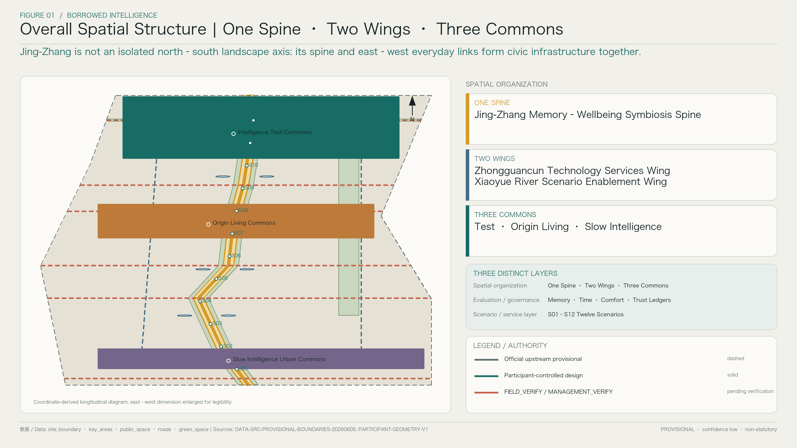

*Figure 1 | The task relationship among the three scope levels; the illustrated boundary remains provisional.*

## Coordinated Research Area: Industry and Future City Research

AI enters urban design not because it needs a special architectural style, but because research, open-source collaboration, commercialization, real-world testing, talent’s daily life, and public trust meet at the same urban interfaces. Proximity among universities, laboratories, and firms does not by itself reduce the cost of collaboration. Gates, crossings, accessible ground floors, places to rest, nighttime services, and continuous accessibility determine whether knowledge and opportunity can circulate.[source:DATA-SRC-AGENT-TASKBOOK-20260518] [depth:existing_conditions_diagnosis]

The proposal organizes the innovation ecosystem as a five-step loop: **universities and research generate ideas → open-source and professional services support collaboration → controlled testbeds verify performance → public display and deliberation build understanding → responsibility enters long-term operation together with the technology**. The Zhongguancun Technology Services Wing provides distributed interfaces for professional services, capital, intellectual property, talent support, and international communication. The Xiaoyue River Scenario Enablement Wing defines real problems through community life, blue-green systems, mobility, and everyday services. Technology does not move directly from a research building into public space; it passes through validation, human review, public deliberation, and an exit plan.[data:geometry/public_space.geojson#PS-WING-W] [data:geometry/public_space.geojson#PS-WING-E]

### Global case comparison and Jing-Zhang translation

This revision replaces the candidate-name index with six cases supported by registered primary sources. They cover AI, robotics and broader innovation districts: the comparison concerns institutions, space and operations, not a claim that all are AI-only parks or that website descriptions prove outcomes. Sourced observations and Jing-Zhang design proposals are separate; undocumented exit, participation and access conditions remain unverified.

#### C01 Kendall Square / MIT, USA

MIT’s resource map lists campus mentoring, licensing and entrepreneurship resources alongside off-campus incubation and shared-laboratory resources. This is a directory, not evidence of collaboration outcomes. [source:CASE-MIT-KENDALL]

| Dimension | Verified observation and limitation |
| --- | --- |
| Institution–city interface | Institution interface: campus and off-campus resource directory. |
| Shared facilities | Shared facilities: LabCentral is listed; access terms were not verified. |
| Talent daily life | Talent daily life: mentoring and venture support are listed; wellbeing outcomes are unproven. |
| Scenario access | Scenario access: the source supplies no public-space testing permission. |
| Community participation | Community participation: representative public involvement is not documented here. |
| Failure and exit | Failure and exit: exit agreements are not documented here. |

Jing-Zhang proposal: Provide staffed resource interfaces at both AI Origin district gateways, using a shared directory of university services, advice and bookable facilities; providers would maintain access rules and hours.

Non-transferable conditions: Do not copy institutional density, financing or access rights; a directory does not establish resource availability in Jing-Zhang.

#### C02 one-north / LaunchPad, Singapore

JTC describes a development bringing together startups, incubators, accelerators and investors, with modular space, amenities and opportunities to pilot across its property portfolio. [source:CASE-JTC-LAUNCHPAD]

| Dimension | Verified observation and limitation |
| --- | --- |
| Institution–city interface | Institution interface: eligibility is defined by participant type. |
| Shared facilities | Shared facilities: modular units; access is not automatically free or unrestricted. |
| Talent daily life | Talent daily life: food and transport information accompanies workspace information. |
| Scenario access | Scenario access: portfolio-wide piloting opportunities still require project admission. |
| Community participation | Community participation: resident co-decision is not established by this page. |
| Failure and exit | Failure and exit: flexible leases are described; test-failure rules are not documented. |

Jing-Zhang proposal: Provide adaptable small work units and controlled test courts at Zhongzhiyuan, with daily services at AI Origin. The foyer would disclose booking, duration, charges and suspension terms.

Non-transferable conditions: Do not transplant Singapore’s rent, subsidy or eligibility regime; verify premises, fire safety, responsibilities and community acceptance locally.

#### C03 Paris-Saclay, France

The public development agency presents campus development, economic activity, cultural life, IPHE business space and shared services within one coordinated development framework. [source:CASE-EPA-SACLAY]

| Dimension | Verified observation and limitation |
| --- | --- |
| Institution–city interface | Institution interface: a public developer coordinates campus and territorial development. |
| Shared facilities | Shared facilities: IPHE and shared university facilities are described. |
| Talent daily life | Talent daily life: cultural life and shared mobility are included. |
| Scenario access | Scenario access: innovation services are described, without transferable blanket permission. |
| Community participation | Community participation: the page describes development consultation with local authorities and residents. |
| Failure and exit | Failure and exit: scenario-specific retirement thresholds are not documented. |

Jing-Zhang proposal: Use a common issue register and coordination ledger across the Three Commons, reviewing mobility and daily services alongside research space. Agreements would define each shared interface.

Non-transferable conditions: Do not copy the French agency’s land powers or financing; verify existing Jing-Zhang ownership and management separately.

#### C04 Toronto MaRS, Canada

MaRS combines innovation workspace, meeting and event venues, and commercialization advice, and describes adaptation of a former hospital heritage building for innovation workspace. [source:CASE-MARS-HUBS]

| Dimension | Verified observation and limitation |
| --- | --- |
| Institution–city interface | Institution interface: workspace connects with investor interaction and advice. |
| Shared facilities | Shared facilities: meeting and event venues; eligibility and pricing require further checks. |
| Talent daily life | Talent daily life: an urban work and meeting setting; universal affordability is not established. |
| Scenario access | Scenario access: this page promises no public testbed. |
| Community participation | Community participation: resident veto rights are not established here. |
| Failure and exit | Failure and exit: service-removal agreements are not documented here. |

Jing-Zhang proposal: Use accessible ground floors of existing buildings in the technology-services wing for advice, display and short meetings; retain authentic interpretation at Dazhongsi and make additions removable.

Non-transferable conditions: Do not equate adaptation with permission to alter buildings; structure, fire safety, ownership and heritage require review.

#### C05 London Knowledge Quarter, UK

KQ links academic, cultural, research and technology organisations through a partnership and publishes its governance and knowledge-exchange aims, organising proximity into an exchange network. [source:CASE-KQ-LONDON]

| Dimension | Verified observation and limitation |
| --- | --- |
| Institution–city interface | Institution interface: partnership, board and member representation. |
| Shared facilities | Shared facilities: members hold diverse resources; membership creates no universal access right. |
| Talent daily life | Talent daily life: exchange network; no living-cost outcome evidence here. |
| Scenario access | Scenario access: knowledge exchange is not permission for real-data tests. |
| Community participation | Community participation: visitors and local users are included in aims; representation needs verification. |
| Failure and exit | Failure and exit: project-stopping thresholds are not documented here. |

Jing-Zhang proposal: Create a small partnership forum linking the technology-services wing and spine, with deliberation tables showing institutional resources and community issues. Membership would confer no control over public space.

Non-transferable conditions: Partnership discussion cannot replace public procedures; member counts and brand exposure cannot substitute for public outcomes.

#### C06 Pittsburgh / Hazelwood Green, USA

CMU describes advanced-manufacturing research in Mill 19 inside a former steel-mill shell and plans for robotics facilities, with sustainability, equity and community-opportunity aims. These aims are not verified outcomes. [source:CASE-CMU-HAZELWOOD]

| Dimension | Verified observation and limitation |
| --- | --- |
| Institution–city interface | Institution interface: university, manufacturing research and industry collaboration. |
| Shared facilities | Shared facilities: research infrastructure; public-access terms were not verified. |
| Talent daily life | Talent daily life: housing and daily convenience are not quantified here. |
| Scenario access | Scenario access: translational research space, without blanket public-testing rights. |
| Community participation | Community participation: equitable opportunity is an aim; implementation representation is unverified. |
| Failure and exit | Failure and exit: project-specific exit rules are not supplied. |

Jing-Zhang proposal: Separate research cores, controlled test courts and public observation at Zhongzhiyuan. Prefer adaptation where existing premises permit it, starting T1/T2 with small removable components.

Non-transferable conditions: This is not geographical evidence for Robotics Row: this revision narrows the case to sourced Hazelwood evidence, without copying investment or land arrangements.

### Regional innovation interfaces

Regional coordination follows two-way issue transfer, method/resource return, local validation and feedback. It introduces no confirmed partners, allocations or investment commitments. Public information supports background roles only; every interface below is a participant proposal pending negotiation. Existing regional cooperation does not authorise this project. [source:REGION-BEIWEI-PUBLIC] [source:REGION-THREE-CITIES-PUBLIC]

| Node and suggested role | Two-way interface | Spatial carrier | Prospective responsibility and exit |
| --- | --- | --- | --- |
| AI Beiwei Community: Candidate interface for developer issues, open exchange and young ventures | Send S11 resource needs and S09 test issues; receive mentor referrals, tool documentation and review feedback | AI Origin gates + technology-services wing | Community operator, foyer and university teams would negotiate; Share only consented project summaries; stop referrals when resources or willingness are absent |
| Future Science City: Candidate interface for energy and advanced-manufacturing questions and methods | Send S03/S07 climate and low-energy service issues; receive expert feedback, methods and constraints | Zhongzhiyuan T1/T2 + Xiaoyue scenario wing | Research liaison, test operator and professional reviewer would negotiate; Promise no equipment or compute; fall back to manual inspection when methods do not fit |
| Huairou Science City: Candidate interface for measurement, scientific methods and basic-research exchange | Send S07 observation issues and T1 validation needs; receive protocol advice, exchange and uncertainty explanations | Zhongzhiyuan test courts + civic forum | Research-facility manager, test operator and independent reviewer would negotiate; Confirm booking and permission separately; do not imply immediate access to major scientific facilities |
| Beijing E-Town: Candidate interface for engineering validation, productisation and supply chains | Send provisionally validated T1/T3 components and failure records; receive engineering advice, supply terms and service boundaries | Zhongzhiyuan controlled tests + Dazhongsi content and retail interfaces | Technology firms, scenario operators and service managers would negotiate; Validation is not procurement; no scaling without maintenance and restoration responsibility |
| Beijing–Tianjin–Hebei network: Candidate interface for external method review, talent exchange and cross-city feedback | Send de-identified scenario cards, ledger definitions and exit cases; receive review reports, adaptation differences and training feedback | Belt-wide issue library + services-wing exchange + Three Commons | Willing universities, city teams and community representatives would negotiate; Require fresh local admission; no personal-trajectory transfer or claims of existing cooperation |

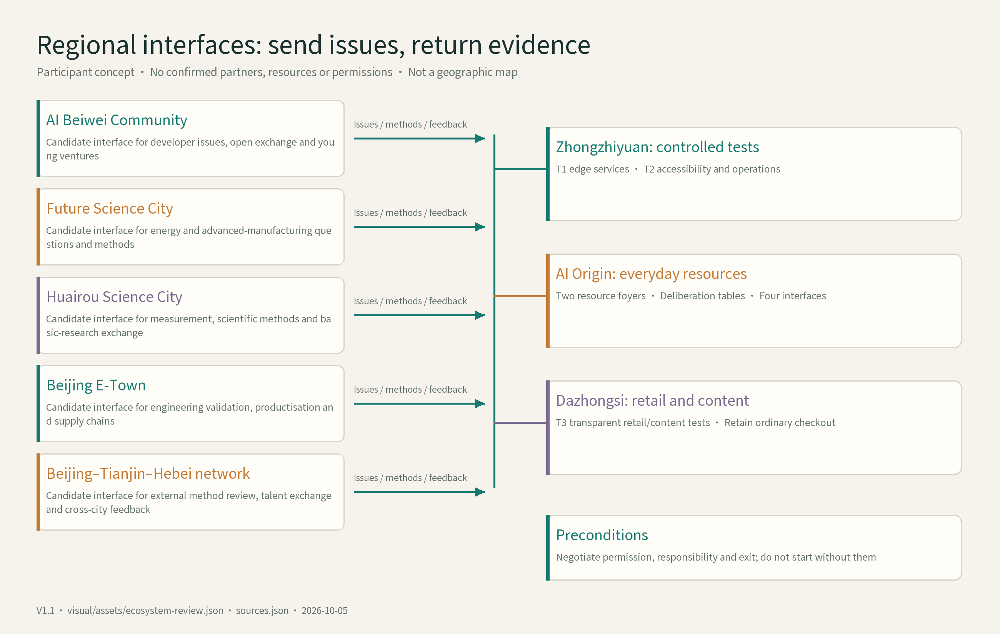

### Eight-element industry-support matrix

Each of the eight elements requires a spatial carrier, prospective responsibility and exit rules. Land and space govern admission; industry and talent organise collaboration; capital and compute constrain operation; data and scenarios provide feedback. All actors are suggested roles, with no confirmed funding, quotas or policy support. Indicators below are future verification items requiring baselines, not achieved performance. [source:PARTICIPANT-ECOSYSTEM-V11]

| Element and supply mechanism | Carrier and responsibility | Admission and exit | Future verification indicators |
| --- | --- | --- | --- |
| Land: Negotiate time-limited use and access boundaries with owners and managers before considering construction | Public ground floors and bookable courts in the Three Commons; Owner/manager + neighbourhood + scenario operator | Written permission, fire safety and maintenance; withdrawal stops the pilot and triggers restoration | Verified authorised slots, conflict records and completed restoration |
| Space: Separate public observation, booked collaboration and controlled research; retain low-tech services | Zhongzhiyuan courts; AI Origin four interfaces; Dazhongsi public ground floors; Building/fire professionals + property manager + community | Verify continuous access, evacuation and hours; reduce access levels when checks fail | Ability-specific route audits, actual opening hours and repair records |
| Industry: Issue intake, controlled validation, public/commercial triage and transfer referrals | Services-wing S11 → Zhongzhiyuan T1/T2 → Dazhongsi T3; University/business teams + service organisations + independent reviewers | Define problem and responsibility first; no public deployment without all four gates | Evidence-backed validation cycles and correction/exit records, not recruitment totals |
| Capital: Account separately for basic public services and AI trials; seek resources by stage | Belt-wide low-tech baseline + Three Commons pilot ledgers; Prospective funder + operator + independent financial reviewer | Confirm budget, upkeep, insurance and exit costs; inadequate funding stops AI while retaining basic service | Budget provenance and execution, upkeep coverage and removal cost; amounts pending estimation |
| Talent: Mentor referrals, youth prototyping and compensated review by users with varied abilities | AI Origin foyer and deliberation tables + services wing; University teams + community + service organisations | Voluntary participation, exit and no digital barrier; shorten or pause burdensome activities | Group-specific opportunities, response time, participant burden and feedback |
| Compute: Prefer edge/offline operation for low-risk services; bookable research compute remains a candidate | Zhongzhiyuan T1 + offline gate terminals; Device/compute provider + operator + safety reviewer | Confirm capacity, power, network and human takeover; faults revert to fixed information | Offline completion, recovery time, energy and faults; no promised allocation |
| Data: Public catalogues, minimal collection, aggregate publication and versioned correction | Four Ledgers + S06/S07/S12; research raw data has separate permissions; Data controller + scenario operator + public review representatives | Confirm purpose, rights and retention first; incidents stop collection and trigger agreed deletion | Traceable-record share, correction response and deletion confirmation; no public personal trajectories |
| Scenarios: Twelve Scenario issue cards → T1/T2/T3 tests → deliberation → keep/modify/stop | Spine and Xiaoyue wing define issues; Three Commons test and use services; Community issue intake + technology validation + manager admission | Pass all four gates; false access, discrimination or absent takeover pauses the service | Low-tech availability, group-specific task completion, appeals and exit drills |

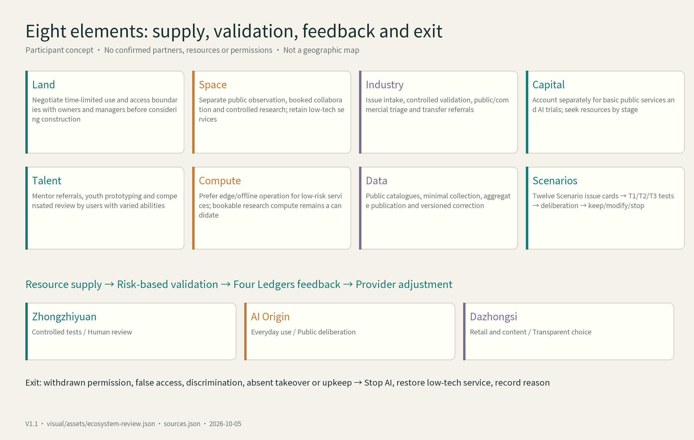

Universities and firms propose capabilities and prototypes; communities define issues along the spine and Xiaoyue wing; the services wing offers referrals and advice. The Three Commons validate by risk level, while the Four Ledgers return results to providers. Managers authorise premises, operators provide takeover and independent reviewers check fairness and evidence. Interrupted supply or failed admission stops AI enhancement, restores low-tech service and informs the issue originator. [data:geometry/public_space.geojson#PS-ZZY-TEST] [data:geometry/public_space.geojson#PS-AIO-SEAM]

The brand **BORROWED INTELLIGENCE** treats urban memory and public judgement as external calibrators of intelligence. The logo direction abstracts three motifs: twin tracks, growth rings, and a data pulse. Twin tracks represent infrastructure and east–west reconnection; growth rings represent a century of time; the pulse represents urban learning that can be explained and paused. A low-saturation grayscale base carries real places and evidence, while a single accent color marks direction, interaction, and evidence status. Cyber imagery never substitutes for urban design.[standard:PROJECT-AGENT-OPEN-CALL-TASKBOOK]

## Overall Design Area: Urban Renewal and Regulatory-Plan-Level Urban Design

The spatial structure does not begin with another north–south landscape axis. Railways, roads, rivers, campus and industrial boundaries, and superblocks jointly produce east–west fragmentation. The **Jing-Zhang Memory–Wellbeing Symbiosis Spine** is therefore first a continuous public-service capacity. Authentic heritage traces, walking and cycling, shade and rain cover, blue-green stormwater functions, rest and assistance, and optional AI support take different forms in different segments while sharing rules for wayfinding, comfort, accessibility, and trust.[data:geometry/public_space.geojson#PS-SPINE-001] [data:geometry/roads.geojson#ROAD-SPINE-001]

The Two Wings are not new continuous development strips. The Zhongguancun Technology Services Wing provides distributed interfaces for accessible ground floors, short meetings, legal and intellectual-property services, talent support, and international communication. The Xiaoyue River Scenario Enablement Wing brings heat, stormwater, accessibility, care, mobility, and public-service problems into testing. Their shared logic is “open resources → define problems → controlled verification → public deliberation → long-term operation.”[data:geometry/public_space.geojson#PS-WING-W] [data:geometry/green_space.geojson#GREEN-XIAOYUEHE-LINK]

The Three Commons are three urban prototypes. Intelligence Test Commons asks whether technology can enter the city responsibly. Origin Living Commons asks how innovation enters everyday life. Slow Intelligence Urban Commons asks whether AI-enabled consumption can preserve human pace and choice. The Four Ledgers—Memory Ledger, Time Ledger, Comfort Ledger, and Trust Ledger—belong to evaluation and governance, not spatial zoning. The Twelve Scenarios are repeatable “problem–space–service–governance” products, not twelve sculptural landmarks.[depth:overall_spatial_structure] [data:geometry/public_space.geojson#PS-S01]

The north–south spine only becomes meaningful through six east–west everyday-life stitches: X01 Qinghe Blue-Green Cross, X02 Qinghuadongluxikou Interface, X03 Wudaokou Everyday-Life Interface, X04 Zhichun Road Time-Equity Interface, X05 Dazhongsi Four-Quadrant Interface, and X06 Beijing North Railway Station Urban Gateway. They are conceptual connections subject to field and professional verification—not road red lines, bridge or tunnel alignments, or approved works.[data:geometry/roads.geojson#ROAD-X01] [data:geometry/roads.geojson#ROAD-X06]

“Heritage authenticity × wellbeing gain × spatial fit × operational sustainability × public trust” is a **conceptual go/no-go threshold**. If any dimension is zero, the design does not proceed to the next stage. The multiplication is not used for ranking, does not generate an aggregate score, and does not conceal trade-offs among public values. Proposals continue to be compared through parallel metrics and the Four Ledgers.

The land-use model covers the provisional site boundary completely, with no gap, overlap, or out-of-bound geometry, and uses only permitted classification semantics. AI scenarios, memory nodes, wellbeing nodes, and the Twelve Scenarios remain public-space or operational layers; they are not invented statutory land-use categories.[data:geometry/land_use.geojson#LU-RESERVE-001] [standard:MNR-LAND-USE-CLASSIFICATION-GUIDE]

## Detailed Design of Key Areas

The Three Commons use the same twelve questions. The purpose is not to impose one image on different places, but to allow comparison of public value, spatial structure, dual pathways, and implementation boundaries. All three stop at the depth of an explainable urban-design prototype. They do not manufacture parcel-level ownership, precise retain-renovate-demolish decisions, statutory height, or committed development scale. Matters lacking field or management evidence are marked FIELD_VERIFY or MANAGEMENT_VERIFY.[depth:three_key_area_detailed_design] [source:PARTICIPANT-GEOMETRY-V1]

### Intelligence Test Commons

| Common question | Design response |
| --- | --- |
| 1. Positioning | A garden-oriented, full-stack innovation district focused on whether technology can enter the city responsibly, connecting research capacity to verification processes the public can understand. |
| 2. Current urban problem | The North Fifth Ring Road, railway, Qinghe River, and compound boundaries overlap. Actual entrances and continuous links among research spaces, communities, the waterfront, and everyday public space remain to be verified. |
| 3. Spatial prototype | A sequence of **research core → controlled test courtyard → public display → deliberation and standards exchange**. Openness increases only as risk decreases. |
| 4. Key public spaces | A blue-green cross, non-AI everyday loop, controlled test courtyard, public display edge, and Civic Intelligence Forum form a testbed that can be entered, observed, and discussed. |
| 5. Key interfaces | The waterfront and community side stays low-threshold. The research and testing side uses booking, legible rules, and safety boundaries. Visibility must not be misrepresented as unrestricted access to a laboratory. |
| 6. Users and scenarios | U03 AI researchers and start-up teams and U07 operators and community organizers are production partners. U01, U02, U06, and other public users observe, apply, comment, and oversee through S07, S09, and S12. |
| 7. AI augmentation | Edge devices assist environmental sensing and accessibility services. Booking systems disclose hours, rules, risks, and results. People handle exceptions, and accountable organizations review published information. |
| 8. Non-AI baseline | Printed rules, physical noticeboards, staffed service, and offline applications remain available. Shade, seating, drinking water, toilet directions, and help do not depend on a smartphone, connectivity, or data authorization. |
| 9. First project triggers | Verify the compound–Qinghe–community interfaces first; then introduce one reversible, identity-free edge-service pilot, a set of Deliberation Tables, and Open Data Markers. |
| 10. Implementation conditions | Confirm the official extent, actual entrances, river and railway conditions, ecology and fire-safety boundaries, and establish responsibility for test safety, energy, maintenance, insurance, and termination. |
| 11. Risks | Excessive data collection, testing accidents, energy and maintenance costs, and confusing public display with unrestricted laboratory access can all undermine trust. |
| 12. Verification items | Walking, accessibility, waterfront, and nighttime continuity are FIELD_VERIFY. Access-control hours, willingness to open tests, accountable operators, and publication procedures are MANAGEMENT_VERIFY. |

The first objective is not the “most advanced” demonstration. It is an urban validation protocol that the public can understand, developers can follow, managers can pause, and all parties can exit. T1 Edge Public-Service Testbed and T2 Accessibility and Operations Testbed begin here. Every test must pass the Public Value Gate, Spatial Fit Gate, Trust and Safety Gate, and Operations and Exit Gate before it enters public space.[data:geometry/public_space.geojson#PS-ZZY-TEST] [data:geometry/buildings.geojson#BLDG-ZZY-RND]

### Origin Living Commons

| Common question | Design response |
| --- | --- |
| 1. Positioning | The established structure of **Two Gates, One Seam, Multiple Courtyards, and Four Interface Levels** organizes innovation and everyday life and asks how innovation enters daily routines. No new spatial concept is added. |
| 2. Current urban problem | Compounds, campuses, and communities have unequal boundaries, access, time, and service information. Actual open routes, access controls, and nighttime conditions have not yet been jointly verified. |
| 3. Spatial prototype | North and South Gates become urban resource entrances; one Everyday-Life Seam links them; multiple courtyards support resources, deliberation, quiet use, and sharing; four interface levels move from fully public to controlled research space. |
| 4. Key public spaces | The Two Gates are staffed and legible public foyers. The Seam is a continuous everyday route. Multiple Courtyards use shared courts and public ground floors for rest, exchange, care, and small events. |
| 5. Key interfaces | I1 Urban Public Interface, I2 Community Shared Interface, I3 Booked Collaboration Interface, and I4 Controlled Research Interface. Openness is not wall removal; permissions must be readable. |
| 6. Users and scenarios | U01, U02, U03, U04, U06, and U07 share one everyday route through S01, S02, S04, S08, and S11. Access depth and service modes vary by need, not by technological identity. |
| 7. AI augmentation | The Resource Foyer offers explainable search; navigation presents choices by time and ability; the Civic Deliberation Agent organizes issues but does not replace facilitation, voting, or appeal. |
| 8. Non-AI baseline | Fixed maps, clear signs, printed event sheets, staffed information, accessible ramps, and continuous seating remain effective. Refusing authorization does not reduce the level of basic service. |
| 9. First project triggers | Implement only the mature package: information upgrades at the Two Gates, comfort repair along the Seam, signs for the Four Interface Levels, and one Shared Courtyard pilot. Do not deepen the structure further. |
| 10. Implementation conditions | The compound, community, campus, and property managers must confirm opening boundaries, fire egress, routine maintenance, event booking, data responsibility, and conflict-resolution procedures. |
| 11. Risks | “Openness” may be reduced to removing boundaries; AI navigation may promise false access; deliberation summaries may be biased; and event traffic may displace community routines. |
| 12. Verification items | Continuous walking, accessibility, and nighttime experience between the Two Gates are FIELD_VERIFY. Access control, courtyard opening, shared ground floors, and operating staff are MANAGEMENT_VERIFY. |

AI Origin is not a showroom foyer for a technology park. It is a set of everyday interfaces that translates research resources into services ordinary people can enter. The Four Interface Levels tell people where access is open, where booking is required, and where research must remain controlled. The Everyday-Life Seam tests whether the Two Gates are truly connected through time, shade, rest, and assistance.[data:geometry/public_space.geojson#PS-AIO-GATE-N] [data:geometry/public_space.geojson#PS-AIO-SEAM] [source:PARTICIPANT-DESIGN-V02]

### Slow Intelligence Urban Commons

| Common question | Design response |
| --- | --- |
| 1. Positioning | A slow-intelligence urban prototype for commuting, culture, retail, content, and international exchange, asking how AI-enabled consumption and city life can preserve human pace and choice. |
| 2. Current urban problem | Rail, roads, superblocks, and station interfaces divide activity into four quadrants. The current official provisional anchor has a known positional discrepancy from the real Dazhongsi design-research location. |
| 3. Spatial prototype | **Four-quadrant connections → public ground floor → slow walking and staying network → AI-native retail and content spaces → international exchange spaces**. A single landmark cannot replace connectivity. |
| 4. Key public spaces | Quadrant connection points, public ground floors, slow-stay routes, a content courtyard, and an international-exchange interface form a conceptual public-space set. Exact placement awaits confirmation of the official anchor. |
| 5. Key interfaces | Interfaces among the station, the cultural setting of Juesheng Temple, commercial ground floors, and streets remain legible, stoppable, and bypassable. Digital installations do not obscure heritage interpretation. |
| 6. Users and scenarios | U04 commuters and night-shift workers, U05 visitors, U06 users with different abilities, and U07 local businesses and operators use S05, S10, and S12 to understand time, choice, and responsibility. |
| 7. AI augmentation | Navigation provides routes for different speeds and abilities; retail assistance explains recommendations and commercial relationships; content spaces provide multilingual interpretation; people can take over critical services. |
| 8. Non-AI baseline | Fixed wayfinding, staffed information, cash and ordinary checkout, printed menus, and cultural explanations remain available. No smartphone, network failure, or refusal of personalization can reduce basic service. |
| 9. First project triggers | Before the official anchor is confirmed, undertake only a four-quadrant walking audit, public-ground-floor agreements, and slow-intelligence retail rules. Make no station-level or parcel-level construction commitment. |
| 10. Implementation conditions | The official key-area anchor must be confirmed. Rail, road, heritage, commercial, and property stakeholders must verify ownership, fire safety, passenger flow, engineering, and long-term operating conditions. |
| 11. Risks | Geometry displacement may be mistaken for a real design boundary; recommender systems may erode choice; commercial content may masquerade as public information; and nighttime activity may affect surrounding daily life. |
| 12. Verification items | Four-quadrant walking, accessibility, crossings, and nighttime staying are FIELD_VERIFY. Public ground floors, retailer participation, opening hours, and international-event operation are MANAGEMENT_VERIFY. |

Dazhongsi strictly follows a dual-track mechanism. `PROV-KEY-003` is used only as the organizer-provided / official repository provisional geometry for machine validation. Dazhongsi Station, Juesheng Temple, and the four-quadrant walking relationships are only real design-research references and cannot be written back as an official boundary. The fixed status remains `official_anchor_status=pending` and `official_validation_geometry_not_equal_real_design_research_location`; Issue #1029 remains **Open**. When the organizer confirms the official anchor, the related geometry, metrics, and narrative must be recalculated together.[source:BACKGROUND-GITHUB-ISSUE-1029] [data:geometry/key_areas.geojson#PROV-KEY-003] [data:geometry/constraints.geojson#CONSTRAINT-ISSUE-1029]

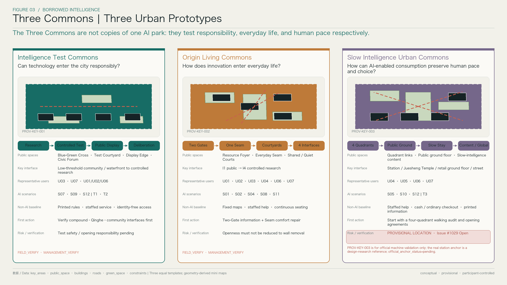

*Figure 2 | The Three Commons are compared through the same questions; the Dazhongsi diagram does not alter its dual-track status.*

## AI Innovation Ecosystem, Personas, and AI+ Scenarios

The seven personas are not marketing segments. They test spatial equity through different schedules, abilities, work patterns, and care responsibilities: U01 Nearby Older Residents and Caregivers; U02 Children, Young People, Students, and Families; U03 AI Researchers, Developers, and Start-up Teams; U04 Cross-District Commuters, Service Workers, and Night-Shift Workers; U05 Heritage Visitors, Urban Explorers, and International Visitors; U06 Wheelchair Users, People with Visual or Hearing Impairments, and Sensory-Sensitive Users; and U07 Local Small Businesses, Community Organizers, and Public-Space Operators. All seven participate in evaluation. Digital fluency never determines the right to basic service.[source:PARTICIPANT-DESIGN-V02] [standard:BARRIER-FREE-ENVIRONMENT-LAW]

The Twelve Scenarios turn abstract AI into auditable everyday services. Each begins with a public service that does not depend on a smartphone, connectivity, or data authorization, and then states what AI may add. During network failure, power outage, model failure, or refusal of data authorization, the non-AI baseline must not degrade.

| Scenario | Priority users and location | Non-AI baseline | AI augmentation and human / exit boundary |
| --- | --- | --- | --- |
| S01 Century Memory Lens | U01, U02, U05; Spine and AI Origin | Authentic remains, a timeline, printed maps, and human interpretation | Multilingual, accessible, and personalized interpretation; sources stay visible and generated content cannot replace historical review. |
| S02 Quiet Borrowed-View Path | U01, U04, U06; Spine and Everyday-Life Seam | Continuous signs, a quiet alternative route, seating, and shade | Suggest routes by noise, crowding, and sensory preference; users can disable location and use a fixed map. |
| S03 Four-Season Comfort Route | All users; Spine and Three Commons | Shade, rain cover, drinking water, rest points, and seasonal maintenance | Suggest comfortable routes using microclimate information; fixed signs and human inspection take over when equipment fails. |
| S04 Accessible Together | U01, U06; six stitches and Two Gates | Ramps, tactile and high-contrast information, continuous rest, and human assistance | Help detect obstacles and suggest accessible routes; prediction must not be presented as verified accessibility. |
| S05 Time-Equity Navigation | U01, U04, U06; stations and Dazhongsi | Standard maps, service times, staffed information, and route options | Show walking, waiting, detour, and care costs; users may choose fastest, most reliable, or least-transfer routes. |
| S06 Public-Space Steward | U07 and all users; Spine and Three Commons | Inspection sheets, cleaning and repair requests, notices, and a staffed hotline | Aggregate facility status and work orders, with human confirmation of exceptions; no default facial recognition. |
| S07 Blue-Green Urban Twin | U02, U03, U07; Zhongzhiyuan and river links | Rain gauges, planting information, human monitoring, and evacuation rules | Assist observation of ponding, heat, and plant condition; models support maintenance judgement but do not replace engineering conclusions. |
| S08 Community Deliberation Agent | U01, U02, U06, U07; AI Origin courtyards | In-person meetings, paper comments, human facilitation, and public minutes | Assist synthesis without replacing voting; provide correction, appeal, deletion, and version records. |
| S09 Open Validation Booking | U03, U07, and the public; Zhongzhiyuan | On-site notices, paper applications, and human safety briefings | Match time and capability and disclose risk and results; refusal of data does not affect offline application. |
| S10 Slow-Intelligence Retail Assistant | U04, U05, U06, U07; Dazhongsi | Ordinary menus, cash and standard checkout, staffed advice, and clear prices | Explain recommendations, allergens, and commercial relationships; personalization can be disabled and must not enable profile-based price discrimination. |
| S11 Innovation Resource Foyer | U03, U07, and communities; AI Origin Two Gates | Service directories, fixed opening hours, and human referrals | Assist matching with spaces, mentors, and professional services; make no outcome promise and route sensitive requests to people. |
| S12 Public Wellbeing Ledger | All users; Three Commons and overall gateways | Periodic disclosure, printed reports, hearings, and complaint channels | Display only aggregate metrics, sources, and uncertainty; never reveal individual traces or hide trade-offs in a total score. |

Three industry tests connect the ecosystem to spatial implementation. T1 **Edge Public-Service Testbed** tests low-data, offline-capable navigation, information, and environmental services. T2 **Accessibility and Operations Testbed** tests the loop from detecting a barrier, through human confirmation, to repair feedback. T3 **Intelligent Retail and Content Testbed** tests transparent recommendations, multilingual content, ordinary checkout, and opting out of personalization. Zhongzhiyuan, AI Origin, and Dazhongsi are priority settings respectively, but no test belongs exclusively to one place.[data:geometry/public_space.geojson#PS-ZZY-TEST] [data:geometry/public_space.geojson#PS-DBZ-CONTENT]

Every test and every scenario passes the Public Value Gate, Spatial Fit Gate, Trust and Safety Gate, and Operations and Exit Gate in sequence. If one gate fails, the service returns to its non-AI baseline or stops. Urban intelligence is not measured by the number of devices, but by whether a service can explain whom it serves, what data it uses, who is responsible, how it fails, and how people can exit.[standard:GENERATIVE-AI-INTERIM-MEASURES]

## Land Use, Building Scale, and Retain-Renovate-Demolish Strategy

Topological completeness is the first priority of the current `land_use` model. It covers 100% of the provisional site boundary, with no gap, overlap, or out-of-bound geometry. It uses official classification semantics to express overall land relationships. One Spine, Two Wings, and Three Commons, the Twelve Scenarios, wellbeing nodes, and memory nodes are expressed through public-space, operational, or design attributes and never become invented statutory land-use codes.[data:geometry/land_use.geojson#LU-RESERVE-001] [standard:MNR-LAND-USE-CLASSIFICATION-GUIDE]

The building layer expresses only comparable spatial types. Zhongzhiyuan includes a research core, controlled laboratory space, public display, and standards exchange. AI Origin includes a Resource Foyer, deliberation space, quiet space, and Shared Courtyard interfaces. Dazhongsi includes public ground floors, content spaces, slow-intelligence retail, and an international-exchange prototype. These types test public ground floors, shared spaces, and courtyard relationships; they are not approved building schemes.[data:geometry/buildings.geojson#BLDG-ZZY-RND] [data:geometry/buildings.geojson#BLDG-DBZ-GROUND]

The qualitative Demolish–Renovate–Retain Strategy identifies value and responsibility before deciding physical action. Spaces with heritage, everyday-service, or adaptive-reuse value are retained first. Underperforming spaces whose structure and ownership permit adaptation are renewed first. New construction or demolition is discussed only after safety, public value, and alternatives have been verified. The proposal does not manufacture exact actions, ownership, Building Height, Floor Area Ratio, Building Coverage Ratio, development capacity, or committed construction quantities.[depth:retain_renovate_demolish] [standard:MOHURD-CONTROL-DETAILED-PLANNING]

Accordingly, `floor_area_ratio`, `building_height_m`, `development_capacity_sqm`, and `statutory_building_density` all remain **unknown / null**. The proposal provides only qualitative urban-design guidance: prioritize public ground floors; treat railway and heritage interfaces cautiously; avoid oppressive massing on important view corridors; and preserve daylight and ventilation in shared courtyards. Values will be recalculated only when official red lines, cadastral records, existing-building surveys, and statutory plans become available. Rendered appearance will not be used to infer numbers.[depth:height_massing_character]

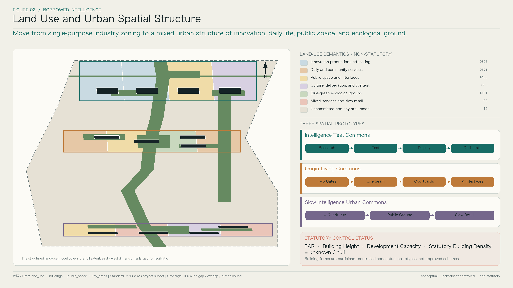

*Figure 3 | Conceptual land-use structure; it provides neither statutory land-use decisions nor parcel-level conclusions.*

## Transport, Rail, Municipal Infrastructure, and Public Services

The mobility strategy replaces speed alone with **time equity**. The Jing-Zhang Memory–Wellbeing Symbiosis Spine provides a north–south Walking and Cycling Network. Six east–west everyday-life stitches, X01–X06, connect rivers, communities, compounds, campuses, stations, and urban gateways. Each stitch tests detour, crossing, waiting, rest, and nighttime legibility for ordinary pedestrians, wheelchair users, and care journeys. Conceptual alignments are not road red lines, bridge or tunnel works, or completed connections.[data:geometry/roads.geojson#ROAD-SPINE-001] [data:geometry/roads.geojson#ROAD-X01]

Transit interfaces follow “low-tech first, AI augmentation second.” Fixed direction signs, clear exit numbers, staffed information, continuous shade, and accessible rest points must work first. S05 may then offer route choices for different speeds and abilities, S04 may assist in identifying barriers, and S06 may aggregate facility work orders. Navigation reports only verified conditions or conditions explicitly marked for verification; algorithmic advice never replaces confirmation by operators and professional authorities.[standard:BARRIER-FREE-ENVIRONMENT-LAW] [data:geometry/constraints.geojson#CONSTRAINT-PATH-FIELD]

Continuous walking conditions, accessibility continuity, actual open routes, and nighttime accessibility remain FIELD_VERIFY. Entrance opening, access-control hours, shared ground floors, and coordination among transit and compounds remain MANAGEMENT_VERIFY. After first submission, V0.3 will gather evidence during weekday peaks and off-peaks, at night, through joint audits with users of different abilities, and after rain. Seasonal observations enter longer-term verification; none is represented as already completed.[source:PARTICIPANT-DESIGN-V03]

Municipal and New Infrastructure is limited to service principles: edge-first processing, minimum data collection, tiered power supply, visible failure, human takeover, maintainable access, and removability. Underground works, integrated utilities, bridge and tunnel alignments, structural loads, equipment capacity, and investment remain **unknown** because professional base data and ownership information are absent. Conceptual geometry is not an engineering-feasibility conclusion.[depth:municipal_new_infrastructure] [data:geometry/constraints.geojson#CONSTRAINT-ENGINEERING-STITCH]

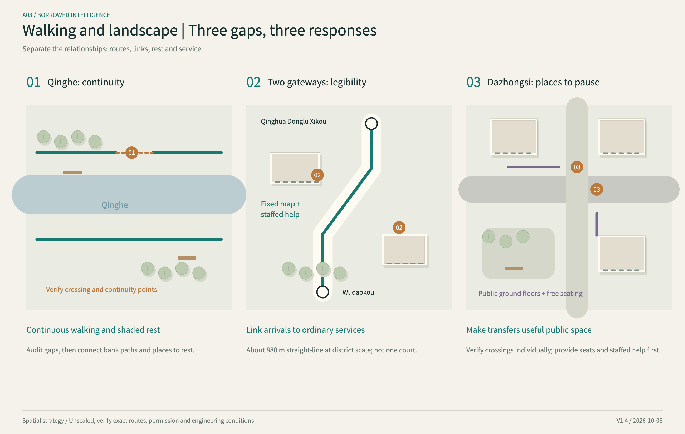

*Figure 4 | The walking–blue-green network; conceptual connections are neither road red lines nor engineering alignments.*

## Blue-Green Network, Public Space, and Urban Character

The blue-green system is not an infill drawing intended to complete an existing-condition statistic. It is a conceptual design model. The Jing-Zhang Spine prioritizes continuous shade and walking conditions that can recover after rain. Qinghe River and Xiaoyue River support regional blue-green links. Rain gardens, pocket green spaces, Shared Courtyards, and buffer planting improve microclimate and staying conditions in the Three Commons. Planting follows Beijing’s principle of the right plant in the right place, using drought- and cold-tolerant, multilayered, low-maintenance communities while pursuing winter sunlight and summer shade. Large-tree conditions, soil depth over underground structures, and structural capacity require later professional review; no engineering-feasibility conclusion is made now.[data:geometry/green_space.geojson#GREEN-SPINE-SHADE] [depth:blue_green_public_space]

The recalculated union area of blue-green space is **1,621,773.893 sqm**, and `green_ratio` is **14.2101%**, with **low** confidence. It is a **design-model value**, **not a complete existing-condition green-space statistic**, and **not a statutory green-space ratio**. OSM and the currently available public sources do not fully cover internal green space in Beijing’s compounds, residential areas, and courtyards. Every comparison and later target must retain this evidence boundary.[metric:green_ratio] [source:PARTICIPANT-ASSUMPTION-REGISTER]

Seven repeatable public-space components establish a coherent but non-uniform character. **Memory Trace** marks authentic time and direction. **Borrowed-View Frame** supports looking, resting, and explanation. **Wellbeing Shelter** combines shade, rain cover, seating, drinking water, printed information, and human assistance. **Barrier-Free Station** provides ramps, tactile information, high contrast, and rest. **Deliberation Table** supports workshops, community meetings, exhibitions, and developer exchange. **Blue-Green Edge** combines stormwater, ecology, and sittable boundaries. **Open Data Marker** explains sources, service limits, equipment status, complaints, and exit routes. Components are combined in response to place rather than deployed as one standard kit over real differences.[source:PARTICIPANT-DESIGN-V01] [data:geometry/public_space.geojson#PS-S03]

Material decisions follow safety and authenticity. Old railway sleepers are not used as touchable public-space surfaces in principle; only after contamination assessment may they be considered for commemorative display or non-contact elements. Ballast does not enter children’s play areas or sitting surfaces. Memory Trace uses contrasting permeable brick or stone inlays first. If metal is necessary, it must be slip-resistant and kept away from ramps and priority crossing paths. Cultural expression begins with traceable remains, archives, and oral histories rather than simulated historic elements.[standard:MOHURD-URBAN-DESIGN-MEASURES]

The three AI pilgrimage landmarks are usable and updatable public-knowledge interfaces, not giant sculptures. **Memory Zero** introduces the city through the Jing-Zhang timeline and authentic remains. **Civic Intelligence Forum** hosts open-source releases, standards discussions, international exchange, and public deliberation. **Wellbeing Clock** discloses aggregate answers to “whose time was saved and whose daily life improved” without showing personal data. The honor system recognizes verifiable public contributions—accessibility repair, open data, low-energy service, responsible exit, and community co-production—rather than ranking places by traffic or device counts.[standard:PROJECT-AGENT-OPEN-CALL-TASKBOOK]

Jing-Zhang railway culture, Zhongguancun innovation culture, and emerging AI culture share one wayfinding language. A grayscale base carries authentic objects and time; an accent color marks direction, service, and evidence status. Physical signs come first and digital content remains optional. Every interpretive point answers five questions: what is this, where does the information come from, how is it used today, who is responsible, and how can it be corrected? Cultural narrative and public service calibrate each other rather than becoming decoration.[source:DATA-SRC-AGENT-TASKBOOK-20260518]

## Renewal Projects, Implementation Policy, and Phasing

Implementation keeps the established four phases and does not substitute one-time construction for continuing governance. Phase 0, **Data and Consensus**, confirms official boundaries and establishes field evidence, management agreements, and a public baseline. Phase 1, **Low-Cost Wellbeing Repair**, prioritizes wayfinding, rest, shade, accessibility breaks, and feasibility of the six stitches. Phase 2, **Three Commons and AI Pilots**, introduces small, pausable tests under the Four AI Admission Gates. Phase 3, **Network and Brand**, extends only projects that have demonstrated public value, accountable responsibility, and operational capacity across the full belt.[data:geometry/phasing.geojson#PHASE-0] [data:geometry/phasing.geojson#PHASE-3]

| Phase | First projects and deliverables | Condition for entering the next phase |
| --- | --- | --- |
| Phase 0 | Organizer geometry updates, V0.3 field audits, heritage inventory, Four-Ledger baseline, management and data-responsibility agreements | Scope and sources are traceable; FIELD_VERIFY and MANAGEMENT_VERIFY items have an accountable party and date. |
| Phase 1 | Two-Gate and Spine wayfinding, seating and shade, Barrier-Free Stations, Wellbeing Shelters, and minor repairs for the six stitches | Basic service works without AI; maintenance and complaint routes are usable. |
| Phase 2 | T1–T3, first combinations of the Twelve Scenarios, public ground floors, and controlled test courtyards | All Four AI Admission Gates pass; human takeover, shutdown, and exit drills work. |
| Phase 3 | One-Spine–Two-Wings network, three landmarks, annual events, and a scenario-opening network | Long-term budgets, operating entities, public performance reporting, and retirement mechanisms exist; short events do not substitute for maintenance. |

Implementation policy follows “small agreements before large works.” Time, responsibility, and maintenance agreements enable limited public-ground-floor access. Data minimization, safety responsibility, insurance, and exit clauses govern scenario testing. Communities and users with different abilities enter decisions through compensated co-design and review. Developers receive clear APIs, site rules, and negative lists. Railway, heritage, river, road, and underground works must enter the relevant professional and statutory processes; the proposal makes no unauthorized commitment.[depth:renewal_project_list] [standard:MOHURD-CONTROL-DETAILED-PLANNING]

Long-term brand assets combine **annual events + developer community + open scenario operation + public honors**. An annual Jing-Zhang Responsible Urban Intelligence Week can first publish the Four Ledgers and scenario questions, then open small tests, followed by public experience, an international standards roundtable, and a review of failures. The developer community maintains a problem library, open-source tools, and exit cases. Scenario operators disclose hours, capabilities, risks, and results. The city brand inherits only verified public value; hardware left after a short exhibition does not count as an urban-renewal outcome.[source:DATA-SRC-AGENT-TASKBOOK-20260518]

Responsibility advances with each phase. Planning and sector authorities confirm boundaries and procedures. Subdistrict and community bodies organize public participation. Owners and property managers carry site-safety and maintenance duties. Technology providers are responsible for models, data, and shutdown. Independent reviewers examine accessibility, equity, and privacy. If the operating entity, budget, human takeover, or exit cost cannot be identified, a project remains in the previous phase.[depth:phasing_implementation]

## Metrics, Area Recalculation, and Compliance Matrix

Metrics are presented in three parallel groups. Spatial outcomes cover the scope area, union areas of blue-green and public space, and continuity of the walking network and everyday-life stitches. Everyday wellbeing measures detour, waiting, rest, shade, accessibility, and service availability for different users. Trust and implementation measure traceable sources, non-AI availability, human review, complaints, shutdown, exit, and long-term maintenance. The three groups are not combined into a total score, because strength in one group must not conceal harm in another.[depth:metrics_recalculation] [source:PARTICIPANT-ASSUMPTION-REGISTER]

| Core metric | Frozen value | Confidence and interpretation boundary |
| --- | ---: | --- |
| `site_area_sqm` | **11,412,825.386 sqm** | low; recalculated from provisional site geometry in EPSG:4548, not the precise area of an official red line |
| Blue-green-space union area | **1,621,773.893 sqm** | low; conceptual design-model extent, deduplicated through union |
| `green_ratio` | **14.2101%** | low; design-model value, not a complete existing-condition statistic and not a statutory green-space ratio |
| Public-space union area | **1,150,746.065 sqm** | low; conceptual participant-controlled public-space union, with overlaps counted once |
| `public_space_ratio` | **10.0829%** | low; conceptual design-model value, not a statutory planning control |

The three core metrics and their underlying areas follow the authoritative order **GeoJSON → metrics**. Drawings, narrative, and later layouts cannot change them in reverse. `floor_area_ratio`, `building_height_m`, `development_capacity_sqm`, and `statutory_building_density` remain **unknown / null**. Without official boundaries, an existing-building survey, cadastral data, and statutory planning controls, ranges, renderings, and case comparisons cannot be used to fabricate precise values.[metric:site_area_sqm] [metric:green_ratio] [metric:public_space_ratio]

The Four Ledgers turn metrics into continuing governance. The **Memory Ledger** records objects, sources, protection status, and corrections to interpretation. The **Time Ledger** records detour, waiting, and service time separately for the seven personas. The **Comfort Ledger** checks shade, winter sunlight, rest, noise, and accessibility by season, time, and ability. The **Trust Ledger** records data, human responsibility, complaint, shutdown, and exit. They are parallel dashboards, not spatial structures, and they do not produce an aggregate score that hides trade-offs.[source:PARTICIPANT-DESIGN-V01]

The compliance matrix connects each task to professional standards, data, and narrative locations. The design-depth matrix distinguishes overall urban-design content from conceptual recommendations. The standards matrix contains professional authorities, while the source registry contains factual provenance. Every evidence marker must exist in its corresponding registry, and source IDs and standard IDs remain separate.[standard:PROJECT-OFFICIAL-ANNOUNCEMENT] [depth:risk_missing_data]

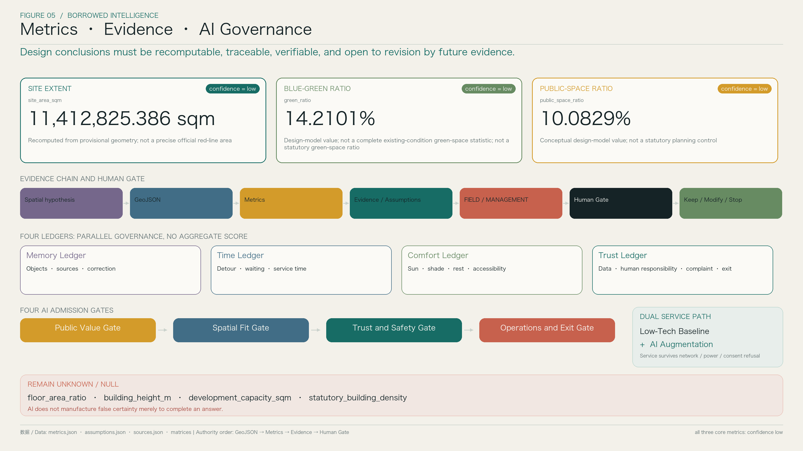

*Figure 5 | Core metrics and evidence boundaries; the diagram does not alter frozen values, confidence, or unknown / null status.*

## Risk, Copyright, and Compliance

The principal scope risk is provisional geometry. `PROV-SITE-001` and the three key-area geometries serve current machine validation only and have low confidence. At Dazhongsi in particular, Open Issue #1029 discloses the discrepancy between `PROV-KEY-003` and the real design-research location. When the organizer updates the geometry, every related geometry, area, ratio, phase, and spatial statement must be recalculated; replacing only the base map is insufficient.[source:BACKGROUND-GITHUB-ISSUE-1029] [data:geometry/constraints.geojson#CONSTRAINT-ISSUE-1029]

Field and management risks use two explicit states. Continuous walking conditions, accessibility continuity, nighttime use, and actual open routes are FIELD_VERIFY. Access-control hours, willingness to open shared spaces, public ground-floor arrangements, operating entities, and maintenance responsibility are MANAGEMENT_VERIFY. These states are not cautious wording; they are evidence tasks after first submission. If verification fails, the design changes—not the facts.[source:PARTICIPANT-DESIGN-V03] [data:geometry/constraints.geojson#CONSTRAINT-GATE-HOURS]

AI risks include incorrect navigation, biased recommendations, excessive collection, identity discrimination, fabricated generated content, commercialization of public information, energy and maintenance burdens, model or network failure, and withdrawal of an accountable operator. Controls are a Low-Tech Baseline, data minimization, purpose limitation, source disclosure, human review, appeal, shutdown, and removability. For public safety, accessibility, heritage facts, and statutory information, a model can never be the sole decision-maker.[standard:GENERATIVE-AI-INTERIM-MEASURES] [standard:ELDERLY-SMART-TECH-PLAN-2020-45]

Planning and engineering limits are equally explicit. The proposal does not provide statutory red lines, cadastral or ownership determinations, precise retain-renovate-demolish decisions, statutory height, Floor Area Ratio, Building Coverage Ratio, development capacity, bridge or tunnel alignments, underground-engineering conclusions, investment commitments, or construction commitments. The conceptual go/no-go threshold decides only whether a design can advance; it is not a scoring formula. The Four Ledgers and parallel metrics retain real conflicts among values.[standard:MOHURD-CONTROL-DETAILED-PLANNING]

The participant submits the text, structured data, and original design expression within the declared license. Rights in official materials, standards, base-map clues, and third-party sources remain with their respective owners. Future images, fonts, photographs, archives, maps, and generated content must be registered with their provenance and license; unverified assets do not enter formal display. Factual citations in this proposal are governed by `sources.json`, professional authorities by `standard_matrix.json`, and the copyright commitment by the package copyright statement.[source:BACKGROUND-LATEST-RULES-VALIDATOR-20260828]

## V1.2 spatial design and visual deliverables

This revision links the belt structure, Three Commons and Twelve Scenarios in one traceable visual system. Public site references, unscaled functional prototypes and AI-generated intentions are separate. District maps retain public coordinates; court prototypes imply no selected parcel, while generated images supply no heights, dimensions, engineering or ownership facts. V1.1 geometry and metrics remain frozen. [source:PARTICIPANT-DESIGN-V12] [source:OSM-REFERENCE-V12]

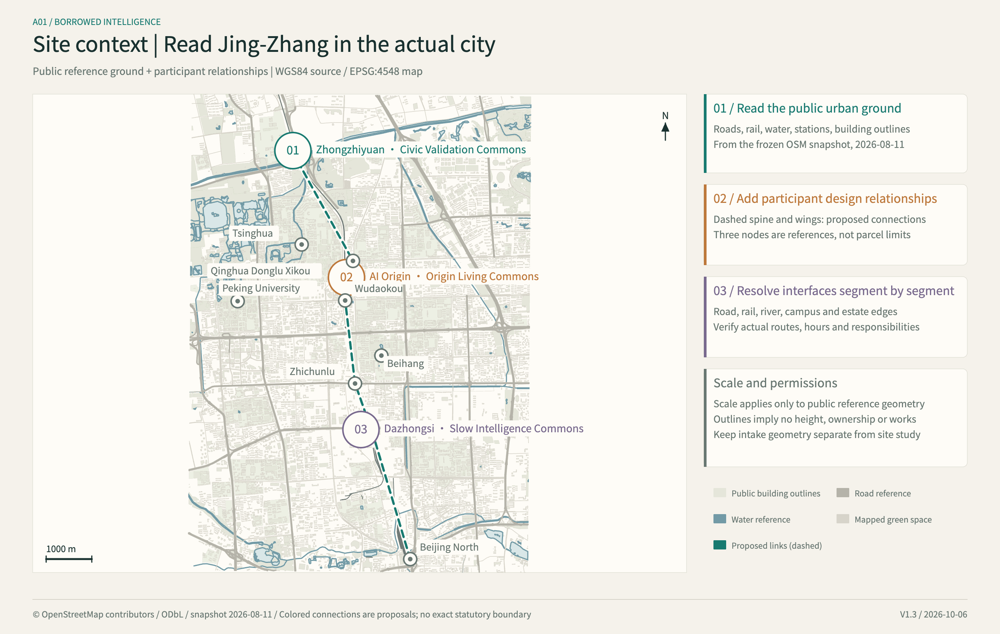

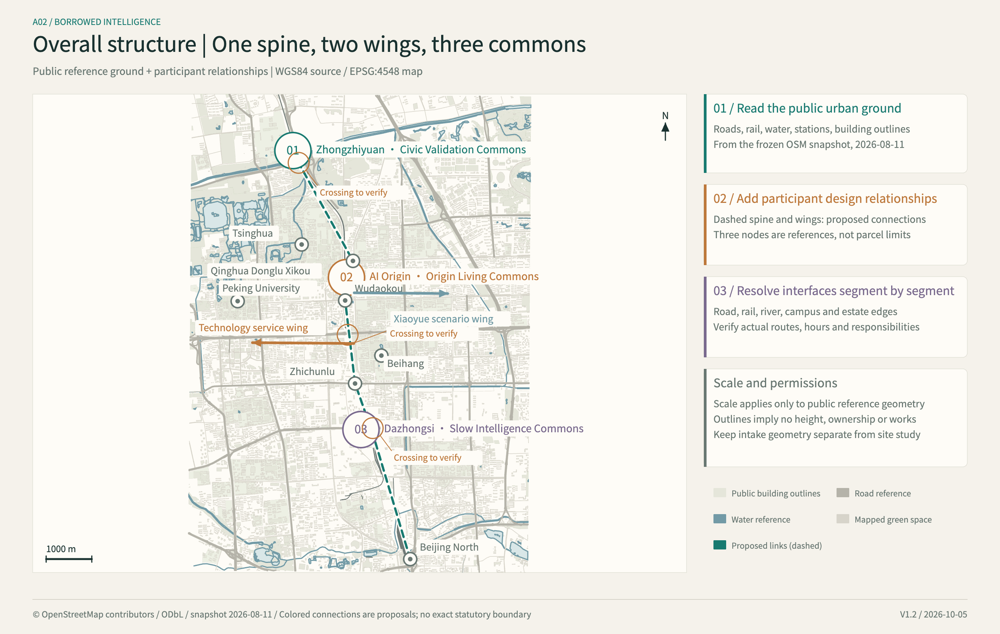

AI Origin’s two gateways are Wudaokou and Qinghua Donglu Xikou transit arrivals. Public anchors are about 880 m apart in a straight line in EPSG:4548, which is neither a walking distance nor an access promise. The district seam and court route are developed separately. Dazhongsi research uses actual public station and cultural references; PROV-KEY-003 retains its original intake role pending clarification of Issue #1029. [source:OSM-REFERENCE-V12] [source:BACKGROUND-GITHUB-ISSUE-1029]

### Zhongzhiyuan: public observation outside test courts

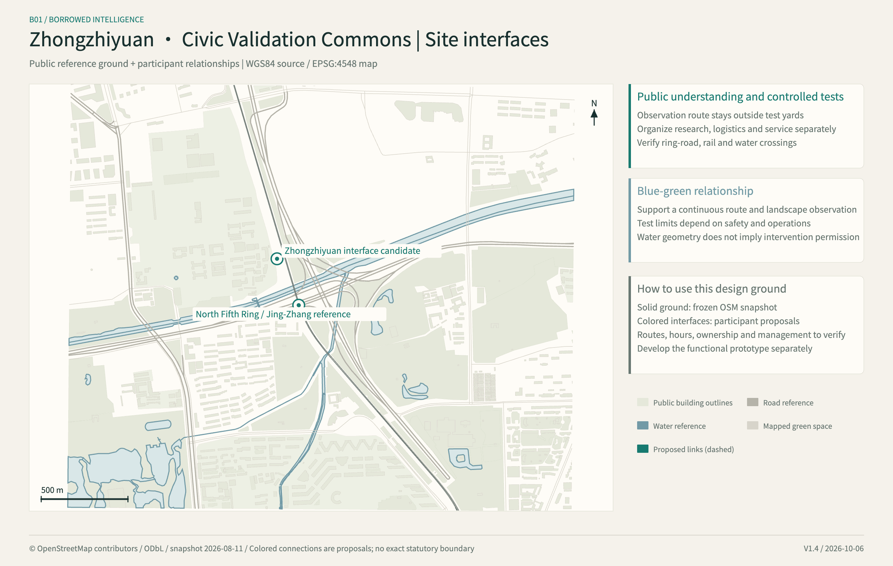

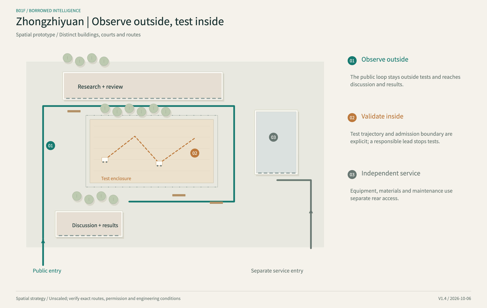

AI-generated concept; unscaled, not an existing-condition reconstruction or implementation approval. Labels are separate editable text.

### AI Origin: continuous everyday route and four interfaces

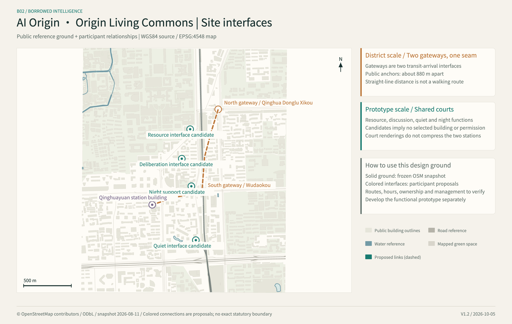

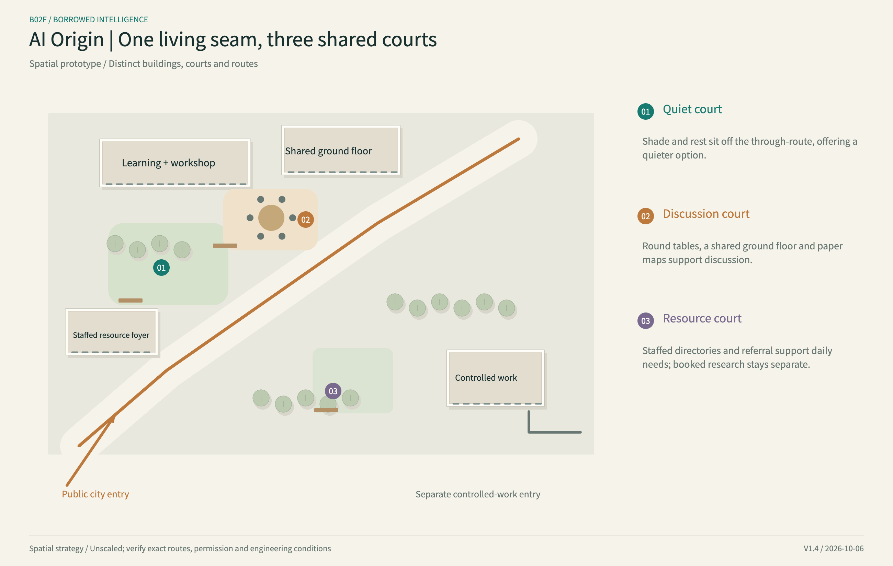

AI-generated concept; unscaled, not an existing-condition reconstruction or implementation approval. Labels are separate editable text.

### Dazhongsi: four-quadrant relationships and free resting

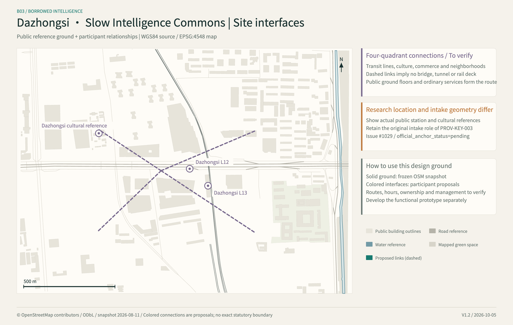

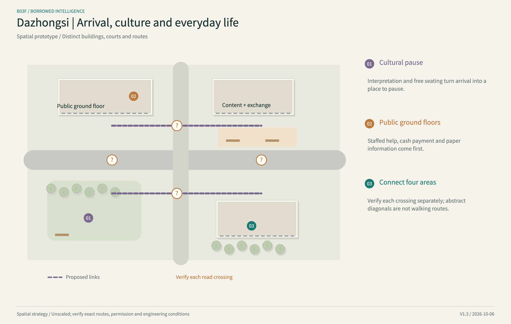

AI-generated concept; unscaled, not an existing-condition reconstruction or implementation approval. Labels are separate editable text.

### Day/evening experience of a typical spine segment

Paired views use the same camera to show a continuous route, ground-floor services and court branches. They depict a typical segment, not a belt-wide aerial, survey plan, water intervention or photometric simulation. Evening use retains public passage and staffed help with the test court inactive; lighting, ecological impacts and hours require separate review.

### Twelve Scenario spatial and human-responsibility cards

#### S01 Century Memory Lens

Help visitors understand memory and its sources / Interpretation station, paper maps, human guide and resting. Heritage interpreter checks facts; remove incorrect generated content

Low-tech baseline: Authentic remains, a timeline, printed maps, and human interpretation

AI enhancement: Multilingual, accessible, and personalized interpretation; sources stay visible and generated content cannot replace historical review.

#### S02 Quiet Borrowed-View Path

Find a quiet alternative to the commuter route / Parallel detour, shaded seats and a clear rejoining point. Operator checks noise and route; show unverified states explicitly

Low-tech baseline: Continuous signs, a quiet alternative route, seating, and shade

AI enhancement: Suggest routes by noise, crowding, and sensory preference; users can disable location and use a fixed map.

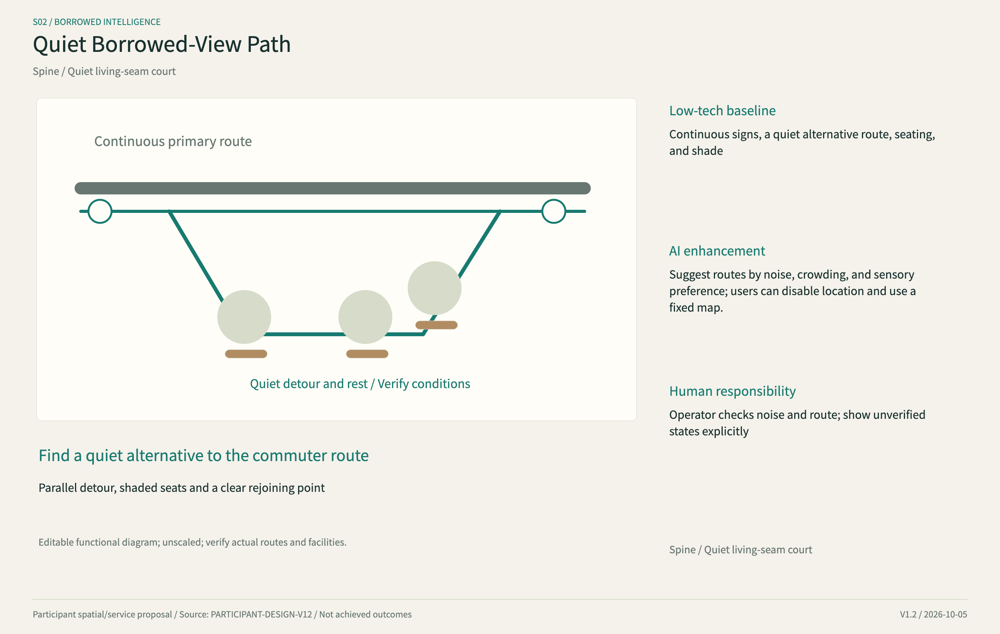

#### S03 Four-Season Comfort Route

Rest in summer shade and winter shelter / Shade, wind shelter, seasonal water and off-route rest. Manager confirms weather and maintenance; faults revert to signs and inspection

Low-tech baseline: Shade, rain cover, drinking water, rest points, and seasonal maintenance

AI enhancement: Suggest comfortable routes using microclimate information; fixed signs and human inspection take over when equipment fails.

#### S04 Accessible Together

Travel continuously from arrival to service / Flush threshold, continuous guidance and off-route rest. Professionals and users verify access; no accessibility promise before checking

Low-tech baseline: Ramps, tactile and high-contrast information, continuous rest, and human assistance

AI enhancement: Help detect obstacles and suggest accessible routes; prediction must not be presented as verified accessibility.

#### S05 Time-Equity Navigation

Compare speed, reliability and care burden / Physical map, staffed help and multiple route choices. Transport operator checks timetables/routes; stale data leaves recommendations

Low-tech baseline: Standard maps, service times, staffed information, and route options

AI enhancement: Show walking, waiting, detour, and care costs; users may choose fastest, most reliable, or least-transfer routes.

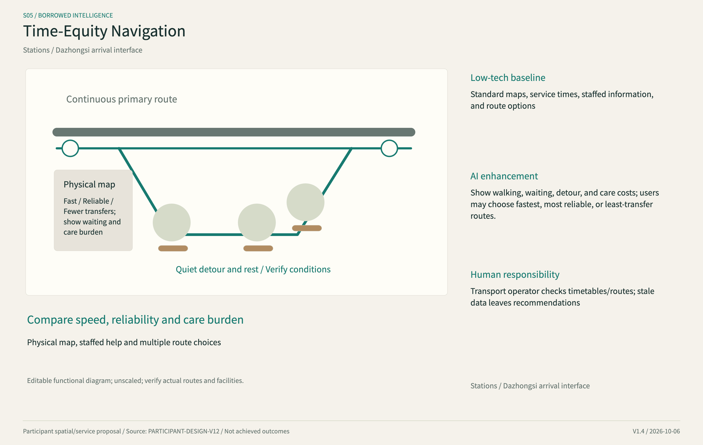

#### S06 Public-Space Steward

Know who handles a reported fault / Inspection, paper job cards, hotline and notice point. Manager confirms and assigns jobs; publish aggregate status, not identities

Low-tech baseline: Inspection sheets, cleaning and repair requests, notices, and a staffed hotline

AI enhancement: Aggregate facility status and work orders, with human confirmation of exceptions; no default facial recognition.

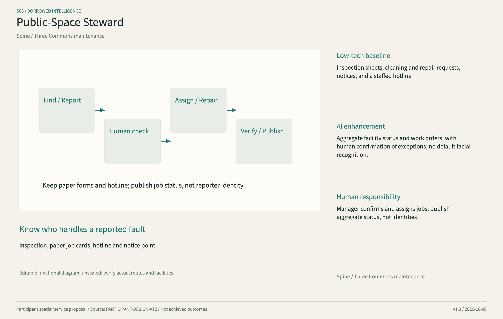

#### S07 Blue-Green Urban Twin

Observe landscape change and model limits / Gauge, plant notes, observation point and safety edge. Professional caretaker verifies alerts; model does not replace flood/engineering decisions

Low-tech baseline: Rain gauges, planting information, human monitoring, and evacuation rules

AI enhancement: Assist observation of ponding, heat, and plant condition; models support maintenance judgement but do not replace engineering conclusions.

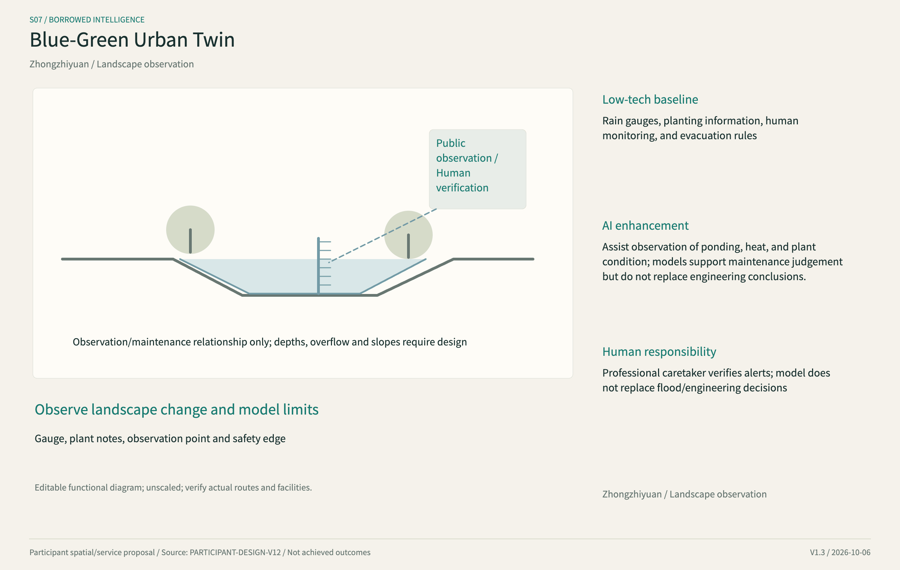

#### S08 Community Deliberation Agent

Bring different views onto one shared map / Round table, paper map, minutes board and indoor fallback. Human facilitation and records; participants correct, AI never replaces voting

Low-tech baseline: In-person meetings, paper comments, human facilitation, and public minutes

AI enhancement: Assist synthesis without replacing voting; provide correction, appeal, deletion, and version records.

#### S09 Open Validation Booking

Understand testing rules before applying / Enclosure, observation path, paper application and staffed post. Test lead controls admission and stopping; separate public route from test trajectories

Low-tech baseline: On-site notices, paper applications, and human safety briefings

AI enhancement: Match time and capability and disclose risk and results; refusal of data does not affect offline application.

#### S10 Slow-Intelligence Retail Assistant

Obtain explanations or use ordinary checkout / Paper menu, staffed counter, optional terminal and free seating. Merchant checks prices/allergens; recommendations can be disabled

Low-tech baseline: Ordinary menus, cash and standard checkout, staffed advice, and clear prices

AI enhancement: Explain recommendations, allergens, and commercial relationships; personalization can be disabled and must not enable profile-based price discrimination.

#### S11 Innovation Resource Foyer

Bring a question to negotiable resources / Physical directory, low counter, human referral and waiting seats. Providers maintain hours/permissions; no guaranteed match or outcome

Low-tech baseline: Service directories, fixed opening hours, and human referrals

AI enhancement: Assist matching with spaces, mentors, and professional services; make no outcome promise and route sensitive requests to people.

#### S12 Public Wellbeing Ledger

See improvements, burdens and uncertainty / Paper notices, four parallel ledgers, appeals and versions. Operator and independent reviewer verify data; aggregate results only

Low-tech baseline: Periodic disclosure, printed reports, hearings, and complaint channels

AI enhancement: Display only aggregate metrics, sources, and uncertainty; never reveal individual traces or hide trade-offs in a total score.

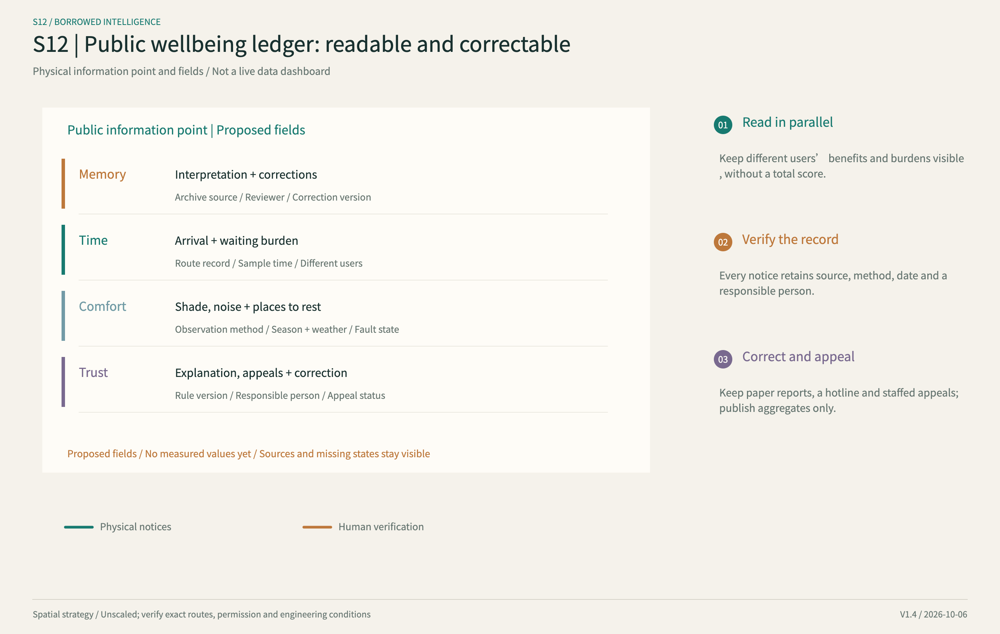

### Brand, components and memory narrative

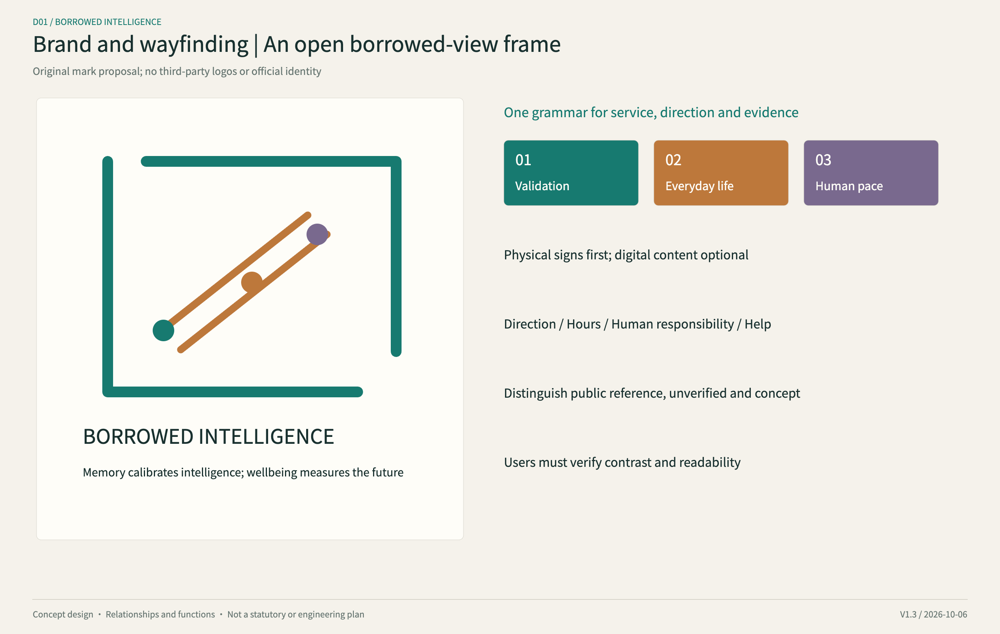

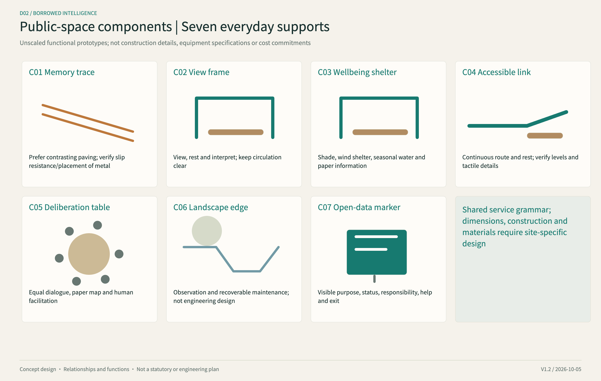

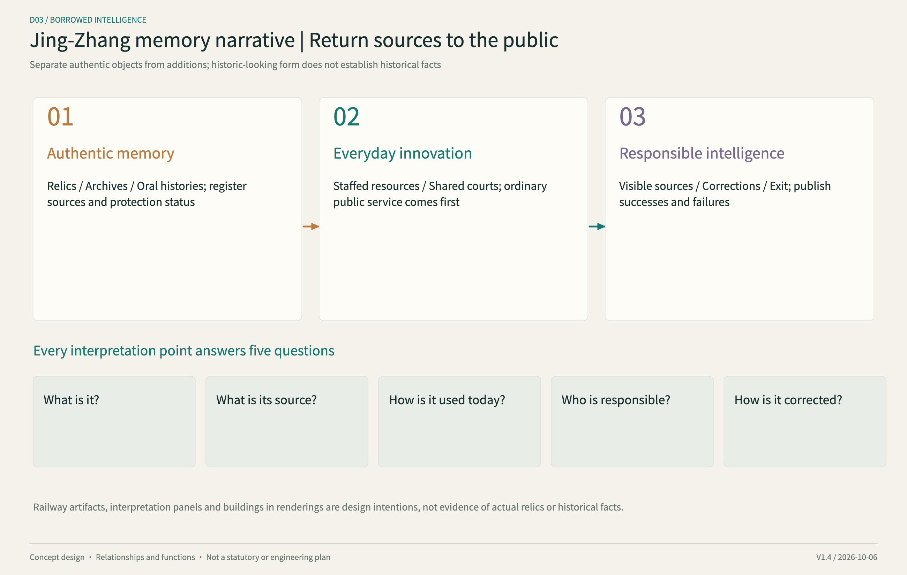

Fine metal lines in renderings express memory continuity; implementation still prefers contrasting paving, with metal slip resistance, thermal contact and placement to verify. The winter view shows shelter, sunny rest and inspection, not snow-melt, slip or drainage performance. Generated railway objects are not relic evidence and paper boards are not archives. All commons retain ordinary services, removable components and human responsibilities. [source:PARTICIPANT-DESIGN-V12]

## References

Direct task sources include the *Prequalification Announcement for the Centennial Jing-Zhang AI Innovation Belt Open Call for Urban Design*, the official Agent Open Call Taskbook, the official provisional-boundaries statement, and the rules and validator current on 2026-08-28. They support, respectively, the task scope, six Agent tasks, machine-validation geometry, and submission contract; none substitutes for another.[source:DATA-SRC-OFFICIAL-ANNOUNCEMENT-20260509] [source:DATA-SRC-AGENT-TASKBOOK-20260518] [source:DATA-SRC-PROVISIONAL-BOUNDARIES-20260605]

Participant design and evidence sources include the *Jing-Zhang Borrowed Intelligence Urban Design Agent Guide V1.0*, the V0.1 overall planning and design assets, the V0.2 AI Origin design assets, the V0.3 post-submission field-evidence package, Geometry V1, and the assumption register. They support design logic and the current conceptual model; they do not become official facts.[source:PARTICIPANT-DESIGN-V01] [source:PARTICIPANT-DESIGN-V02] [source:PARTICIPANT-GEOMETRY-V1]

Professional standards in the package’s standard matrix principally address urban-design administration, regulatory detailed planning, land-use classification for territorial surveys and plans, accessibility, governance of generative-AI services, and measures to help older people use intelligent technologies. Their citation identifies principles and later verification requirements; it does not claim that this conceptual proposal has completed statutory review.[standard:MOHURD-URBAN-DESIGN-MEASURES] [standard:MNR-LAND-USE-CLASSIFICATION-GUIDE] [standard:BARRIER-FREE-ENVIRONMENT-LAW]

New case and regional sources were accessed on 2026-10-05. Links support traceability; prose is independently paraphrased and translated into design proposals, without copying website images, maps, trademarks or extensive text. Pages with no displayed publication date are recorded as undated.

- MIT Innovation Initiative — Kendall Square / MIT, USA — https://innovation.mit.edu/assets/MIT-Innovation-Ecosystem-Map.pdf [source:CASE-MIT-KENDALL]
- JTC Corporation — one-north / LaunchPad, Singapore — https://www.jtc.gov.sg/find-space/launchpad--onenorth [source:CASE-JTC-LAUNCHPAD]
- EPA Paris-Saclay — Paris-Saclay, France — https://epa-paris-saclay.fr/letablissement-public-damenagement-de-paris-saclay/ [source:CASE-EPA-SACLAY]
- MaRS Discovery District — Toronto MaRS, Canada — https://hubs.marsdd.com/ [source:CASE-MARS-HUBS]
- Knowledge Quarter London — London Knowledge Quarter, UK — https://www.knowledgequarter.london/ [source:CASE-KQ-LONDON]
- Carnegie Mellon University Robotics Institute — Pittsburgh / Hazelwood Green, USA — https://www.ri.cmu.edu/carnegie-mellon-richard-king-mellon-foundation-announce-historic-partnership-to-accelerate-cmus-science-and-technology-leadership-and-the-transformation-of-hazelwood-green-foundation-appro/ [source:CASE-CMU-HAZELWOOD]

V1.2 generation and mapping records: visual/assets/visual-design-register.json, map-derivation.json and design-object-register.json. Original OSM snapshots and complete editable SVG sources are retained in the local design-source archive.
